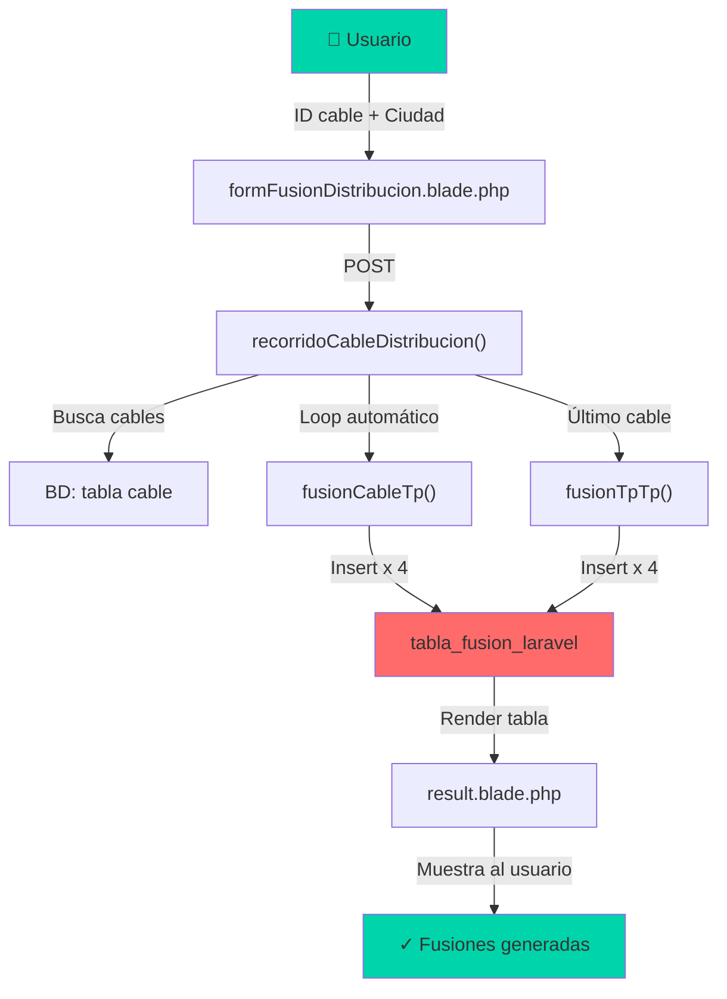
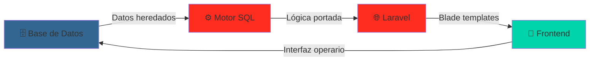
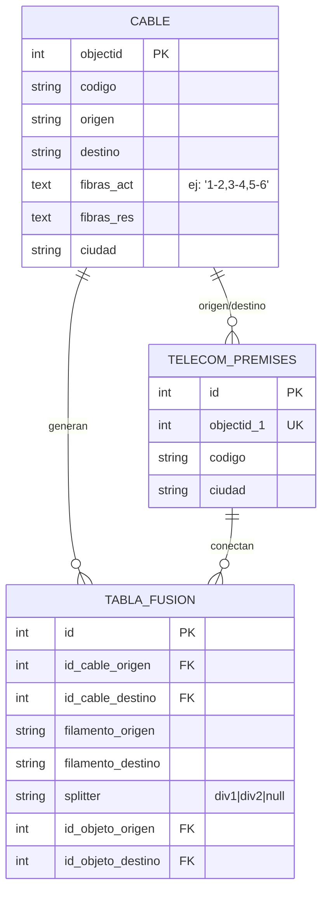

# Motor de Fusiones FTTH

<div align="center">


**Sistema completo de automatización de fusiones de fibra óptica para redes FTTH**

[Características](#características) • [Arquitectura](#arquitectura) • [Quick Start](#quick-start) • [Documentación](#documentación)

</div>

---

## 📌 Visión General

Sistema desarrollado durante un **proyecto real en telecomunicaciones** que automatiza el proceso de fusión de fibra óptica en redes FTTH. Lo que antes era **100% manual**, ahora se hace en segundos.

Construido en **dos fases**:
- **Fase 1**: Motor SQL en PostgreSQL con funciones PL/pgSQL
- **Fase 2**: Aplicación web en Laravel para operarios

```
[CTO-001] ---Cable A--- [CTO-002] ---Cable B--- [CTO-003] ---Cable C--- [CTO-Final]
                         ↓                         ↓                        ↓
                    FUSIONA → FUSIONA → FUSIONA → SPLITTER
```

---

## ✨ Características

- ✅ **Recorrido automático**: Navega cadenas de cables y genera todas las fusiones
- ✅ **Motor SQL optimizado**: Versión original + versión mejorada con model normalizado
- ✅ **Interfaz web intuitiva**: Blade templates con diseño minimalista
- ✅ **Datos de ejemplo**: Dataset reproducible para testing
- ✅ **Bien documentado**: Architecture docs + decisiones técnicas
- ✅ **Dos tipos de recorrido**: Distribución (cable-cable) + Alimentación (cabecera-splitter)

---

## 🏗️ Arquitectura

### Flujo de datos



### Estructura del proyecto



---

## 📊 Modelo de Datos

### Tablas principales



---

## 🚀 Quick Start

### Requisitos
- **PHP 8.0+**
- **Composer**
- **Node.js 14+** (npm)
- **MySQL/PostgreSQL**

### Instalación rápida

```bash
# 1. Clonar y navegar
cd web

# 2. Instalar dependencias
composer install
npm install

# 3. Configurar entorno
cp .env.example .env
php artisan key:generate

# 4. Base de datos
php artisan migrate

# 5. Compilar assets y servir
npm run dev          # Terminal 1
php artisan serve    # Terminal 2

# 6. Abrir en navegador
# http://localhost:8000
```

> 📚 **[Ver guía detallada de instalación →](docs/QUICKSTART.md)**

---

## 🖼️ Interfaz

### Página de inicio
Dos opciones de recorrido disponibles:
- **01 Distribución**: Recorre red de distribución cable-cable
- **02 Alimentación**: Recorre tramo de alimentación

### Formulario
Campo simple:
- ID del cable inicial (objectid)
- Ciudad (para filtrar proyectos de red)

### Resultado
Tabla con todas las fusiones generadas:

| Cable origen | Fil. origen | Fil. destino | Cable destino | TP origen | TP destino | Splitter |
|---|---|---|---|---|---|---|
| CBL-A | 1 | 13 | CBL-B | CTO-001 | CTO-002 | — |
| CBL-A | 2 | 14 | CBL-B | CTO-001 | CTO-002 | — |
| CBL-A | 5 | 17 | CBL-B | CTO-001 | CTO-002 | **div1** |
| ... | ... | ... | ... | ... | ... | ... |

---

## 📚 Documentación

| Archivo | Propósito |
|---------|-----------|
| [decisiones_tecnicas.md](docs/decisiones_tecnicas.md) | Contexto del problema + decisiones de diseño |
| [ARQUITECTURA.md](docs/ARQUITECTURA.md) | Detalles técnicos + componentes |
| [QUICKSTART.md](docs/QUICKSTART.md) | Guía step-by-step de instalación |

---

## 🔬 Testing

```bash
# Ejecutar tests
php artisan test

# Con cobertura
php artisan test --coverage
```

---

## 🏢 Estructura del Repositorio

```
Proyecto-real-telecomunicaciones/
│
├── sql/                              ← Motor SQL (2 versiones)
│   ├── legacy/
│   │   └── 01_fusion_original.sql    ← Original usado en producción (heredado)
│   ├── improved/
│   │   ├── 01_schema.sql             ← Rediseño normalizado
│   │   └── 02_funciones.sql          ← Funciones set-based optimizadas
│   └── sample_data/
│       └── datos_ejemplo.sql         ← Dataset reproducible
│
├── web/                              ← Aplicación Laravel
│   ├── app/Http/Controllers/
│   │   └── TablaFusionController.php ← Lógica portada de SQL a PHP
│   ├── database/
│   │   ├── migrations/               ← Schema (4 tablas)
│   │   └── seeders/
│   ├── resources/views/TablaFusion/
│   │   ├── index.blade.php           ← Inicio (selector de tipo)
│   │   ├── formFusionDistribucion.blade.php
│   │   ├── formFusionAlimentacion.blade.php
│   │   └── result.blade.php          ← Tabla de resultados
│   ├── routes/
│   │   └── web.php
│   ├── .env.example                  ← Configuración plantilla
│   └── composer.json
│
├── docs/
│   ├── decisiones_tecnicas.md        ← Problema + decisiones + comparativa
│   ├── ARQUITECTURA.md               ← Detalles técnicos (EN CONSTRUCCIÓN)
│   └── QUICKSTART.md                 ← Setup step-by-step (EN CONSTRUCCIÓN)
│
├── README.md                         ← ← ← Estás aquí
├── .gitignore
└── .github/workflows/                ← CI/CD (OPCIONAL)
```

---

## 🔄 Comparativa: Original vs Mejorado

La aplicación incluye **dos versiones del motor SQL** para mostrar desde dónde se partió y adónde pudo haber ido con tiempo:

| Aspecto | Original (sql/legacy) | Mejorado (sql/improved) |
|---|---|---|
| **Modelo datos** | Fibras en texto `'1-2,3-4'` | Normalizado (1 fila por par) |
| **Parsing** | `string_to_array() + split_part()` | JOINs nativos SQL |
| **Lógica iteración** | FOR loop procedural | Set-based con UNION ALL |
| **Splitter** | IF condición dentro loop | CASE en query |
| **Queries/iteración** | 3-4 SELECT INTO por cable | 1 INSERT consolidado |
| **Escalabilidad** | ⚠️ O(n) secuencial | ✅ O(log n) set-based |
| **Mantenibilidad** | Acoplado a formato texto | Desacoplado (normalizado) |
| **Fuente** | Producción real | Propuesta mejorada |

---

## 🎯 Fase 1 — Motor SQL

### Problema del modelo heredado

El sistema GIS de la empresa **no era modificable** (otros sistemas dependían de él). Guardaba fibras así:

```
cable.fibras_act = '1-2,3-4,5-6'
cable.fibras_res = '7-8,9-10,11-12'
```

Cada `,` separa un par. La posición indica a qué TP va (posición 1→TP1, posición 2→TP2, última→splitter).

**Desafío**: Automatizar rebajas con esa estructura heredada.

### Versión Original — `sql/legacy/01_fusion_original.sql`

Tres funciones que trabajan encadenadas:

```sql
-- 1. Fusión entre dos cables en un mismo punto
fusion_cable_tp(
    id_cable_origen, id_cable_destino,
    id_tp_origen, id_tp_destino
)
-- → Explode fibras × 2 tipo × 2 filamentos = 4 INSERT

-- 2. Caso final sin cable destino
fusion_tp_tp(
    id_cable_origen,
    id_tp_origen, id_tp_destino
)
-- → Todos a splitter

-- 3. Recorrido automático
recorridoCable(id_cable_inicial, ciudad)
-- → Loop de cables, llamadas a 1 y 2
```

**Característica**: Resuelve el problema en producción con las restricciones del modelo.

### Versión Mejorada — `sql/improved/`

Propuesta de cómo se hubiera diseñado **sin restricciones**:

```
-- Tabla normalizada
cable_fibra (cable_id, orden, filamento_a, filamento_b, tipo)
-- No más parsing de strings

-- Función set-based
SELECT ... UNION ALL ...
```

**Ventaja**: Código más limpio, escalable, testeable.

> 📖 Detalles completos → [decisiones_tecnicas.md](docs/decisiones_tecnicas.md)

---

## 🌐 Fase 2 — Aplicación Web (Laravel)

### Objetivo
Exponer el motor a operarios sin que toquen la BD.

### Rutas

```
GET  /
    ↓
    Elige tipo (Distribución / Alimentación)
    ↓
GET  /fusion/distribucion
    ↓
    Formulario (ID cable + Ciudad)
    ↓
POST /fusion/distribucion
    ↓
    recorridoCableDistribucion()
    ├─ Loop automático
    ├─ fusionCableTp() × N
    ├─ fusionTpTp()
    └─ Insert en tabla_fusion_laravel
    ↓
    Render result.blade.php
    ↓
    Tabla con fusiones generadas
```

### Controlador: TablaFusionController.php

```php
recorridoCableDistribucion()      // Orquesta todo
├─ fusionCableTp()               // Lógica cable-cable
├─ fusionTpTp()                  // Lógica final
└─ recorridoAlimentacion()       // Variante para alimentación
```

Lógica **portada directamente** del SQL al PHP con:
- `explode()` ↔ `string_to_array()`
- `DB::table()` ↔ `SELECT`
- Arrays ↔ estructuras SQL

---

## 🗄️ Tablas

```
cable
├─ objectid (PK)
├─ codigo (ej: 'CBL-001')
├─ origen / destino (TPcódigos)
├─ fibras_act / fibras_res (texto heredado)
└─ ciudad

telecom_premises
├─ objectid_1 (FK a cable)
├─ codigo (ej: 'CTO-001')
└─ ciudad

tabla_fusion_laravel (resultado)
├─ id_cable_origen
├─ id_cable_destino
├─ filamento_origen / destino
├─ splitter ('div1', 'div2', null)
└─ id_objeto_origen / destino (FK a TP)

tabla_fusion_alimentacion (resultado, mismo schema)
```

---

## 🛠️ Cómo Ejecutar

### Opción A: Aplicación Laravel (recomendado)

```bash
cd web

# Setup
composer install
npm install
cp .env.example .env
php artisan key:generate

# BD
php artisan migrate

# Desarrollo
npm run dev           # Terminal 1
php artisan serve     # Terminal 2

# → Abre http://localhost:8000
```

> 📚 [Guía detallada →](docs/QUICKSTART.md) (en construcción)

### Opción B: Motor SQL directo

```bash
# PostgreSQL 12+
psql -U usuario -d base_datos

\i sql/improved/01_schema.sql
\i sql/sample_data/datos_ejemplo.sql
\i sql/improved/02_funciones.sql

-- Ejecutar
SELECT recorrido_red(1, 'CIUDAD EJEMPLO');

-- Ver resultados
SELECT * FROM fusion_resultado;
```

---

## 📦 Tech Stack

| Capa | Tecnología |
|---|---|
| **Servidor** | PHP 8.0+ |
| **Framework** | Laravel 9.19 |
| **Frontend** | Blade templating |
| **BD** | PostgreSQL / MySQL |
| **Build** | Vite.js |
| **Estilos** | CSS personalizado (dark mode) |

---

## 💼 Contexto Profesional

- **Iniciativa**: Proyecto real en empresa de telecomunicaciones
- **Problema**: Proceso 100% manual documentando fusiones
- **Solución**: Automatización SQL + web
- **Resultado**: Reducción de tiempo de coordinación, menos errores

La versión SQL **original está en producción**. La versión **mejorada es propuesta** de refactor.

---

## 📄 Licencia

MIT

---

## 👨‍💻 Autor

**Andrés Provira**

- 🔗 [GitHub](https://github.com/andresdatalyst)
- 📧 [Email](mailto:tu@email.com)

---

## 🚀 Próximos pasos (ideas)

- [ ] Tests unitarios para recorrido
- [ ] API REST (NextJS/API)
- [ ] Dashboard de estadísticas
- [ ] Exportar resultados (CSV/PDF)
- [ ] Versión con GraphQL
